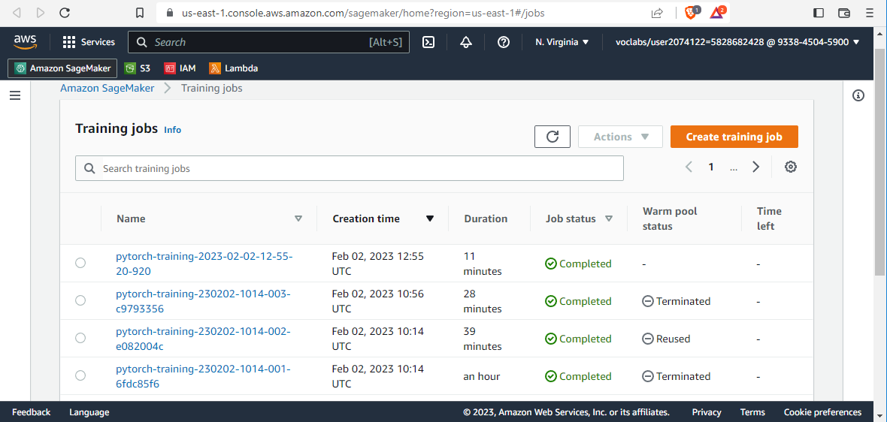
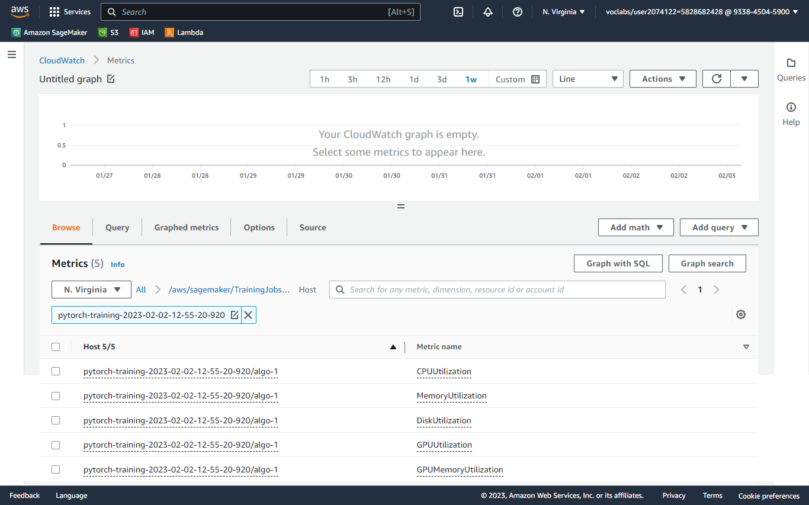
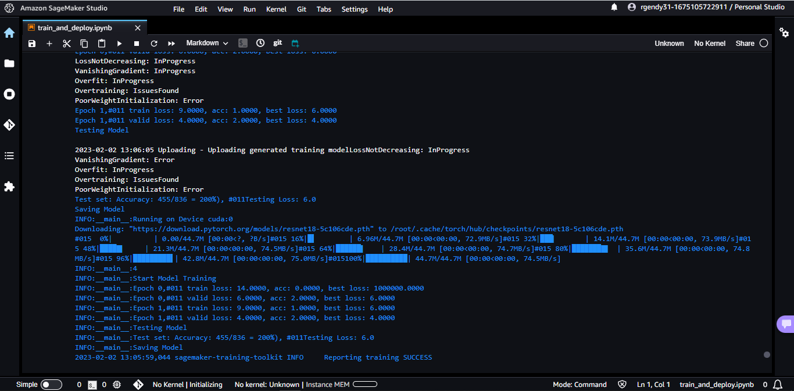
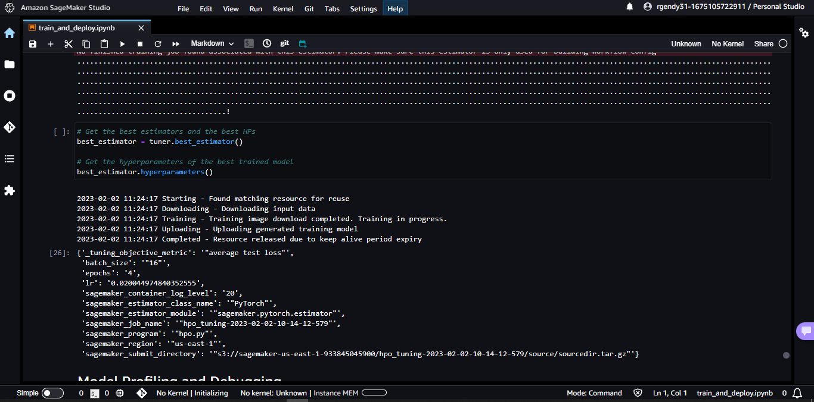
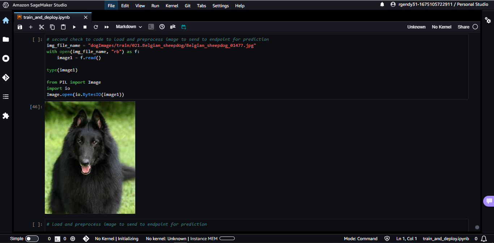
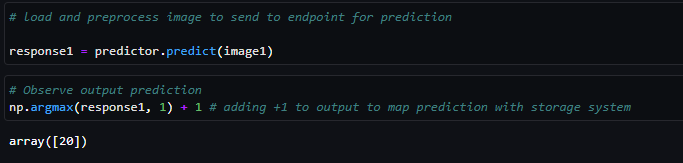
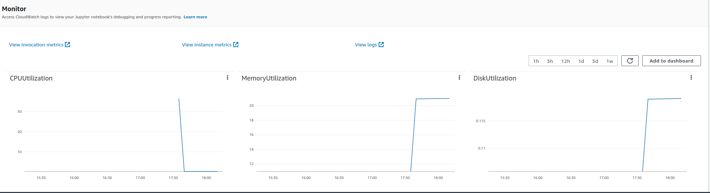

# Image Classification using AWS SageMaker

Use AWS Sagemaker to train a pretrained model that can perform image classification by using the Sagemaker profiling, debugger, hyperparameter tuning and other good ML engineering practices. This can be done on either the provided dog breed classication data set or one of your choice.

## Project Set Up and Installation
 1. Enter AWS through the gateway in the course and open SageMaker Studio. 
 2. Download the starter files [train_and_deploy.ipynb](train_and_deploy.ipynb).
 3. Download/Make the dataset available. 

## Dataset
The provided dataset is the dogbreed classification dataset which can be found in: 
* https://s3-us-west-1.amazonaws.com/udacity-aind/dog-project/dogImages.zip

The project is designed to be dataset independent so if there is a dataset that is more interesting or relevant to your work, you are welcome to use it to complete the project.

### Access
Upload the data to an S3 bucket through the AWS Gateway so that SageMaker has access to the data. 

## Hyperparameter Tuning
This part to finetune a pretrained model with hyperparameter tuning with a minimum of two hyperparameters.

By Choosing a pre-trained Resnet18 model and using transfer learning to train the model on a specific dataset because it allows to leverage the knowledge and capabilities of a well-known and widely-used model, while still being able to fine-tune the model to the specific characteristics and patterns of the dataset. This can help you achieve good results more quickly and with less data, and is a common approach in many machine learning applications. 

By using a pre-trained model as a starting point, leverage the knowledge and capabilities that the model has already learned, which can help you achieve good results more quickly and with less data.

Transfer learning can be an effective way to fine-tune a pre-trained model for a specific task or dataset. By training the model on a new dataset, you can adapt the model to the specific characteristics and patterns of that dataset, which can help improve the model's performance.

The Resnet18 model is a well-known and widely-used model that has achieved good results on a variety of image classification tasks. It is a good choice for many tasks because it is relatively lightweight and efficient, yet still has good performance.

To further optimize the performance of the model by Sagemaker's hyperparameter tuning capabilities and to search for the optimal combination of hyperparameters for the model including:

 * Defining a range of values for each hyperparameter to be tuned
 * Running multiple training jobs with different combinations of hyperparameters
 * Using the Sagemaker Tuner to select the best combination of hyperparameters based on the results of the training jobs.

1. Completed training jobs:

2. Logs metrics during the training process:

3. Tune at least two hyperparameters:

4. Retrieve the best hyperparameters:

## Debugging and Profiling
For improving performance with accuracy of the model, we used Sagemaker profiling and debugging tools to identify and address bottlenecks and issues in the training process.

To perform and evaluate the results of model debugging and profiling in Sagemaker, you can follow these steps:

 1. Set up the Sagemaker debugger and profiler. 
    This is done by specifing the model and the training data that you want to use for debugging and profiling. You can also specify any additional parameters or configurations, such as the instance type or the data processing options.

 2. Start the training job using the Sagemaker.
    This will initiate the training process and enable the debugger and profiler to collect data and identify issues with the model's training and evaluation processes.

 3. Monitor the progress of the training job using the Sagemaker Python SDK or the AWS Management Console.

 4. Finally, You can check the status of the job and view the output of the debugger and profiler.

Analyze the results of the debugging and profiling to identify and address any issues with the model's training and evaluation processes. Then evaluate the results of the debugging and profiling by comparing the performance of the model before and after the debugging and profiling process. You can do this by measuring metrics such as accuracy, precision, and recall, and comparing these metrics.

Profiler rules and configuration were created.

### Results
One Major insights in the report was based on the Batch size hyper parameter. This allowed to test with multiple batch size. Ignoring others as they were more from dataloading and infrastructure perspective.

[Profiler Report Notebook](/ProfilerReport/profiler-output/profiler-report.ipynb)

[Profiler Report HTML](/ProfilerReport/profiler-output/profiler-report.html)

## Model Deployment

1. Install the AWS SDK for Python (Boto3).

2. Import the necessary modules and create a client for the SageMaker runtime service. To do this, you will need to provide your AWS access key and secret access key.

3. Set the name of the endpoint that you want to query and the input data that you want to send to the endpoint. The input data should be a byte array that contains the image data, encoded in a format such as JPEG or PNG.

4. Call the invoke_endpoint method of the client, passing in the endpoint name and the input data. This will send the input data to the endpoint and return the model's prediction as a response.

5. Extract the model's prediction from the response. The prediction will be returned as a JSON object in the 'Body' field of the response.

Query the endpoint with a sample input:

A screenshot of the deployed active endpoint in Sagemaker.

